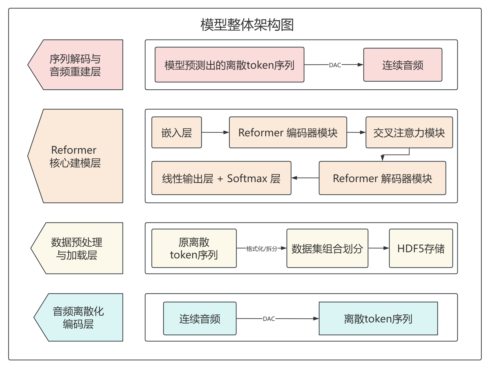
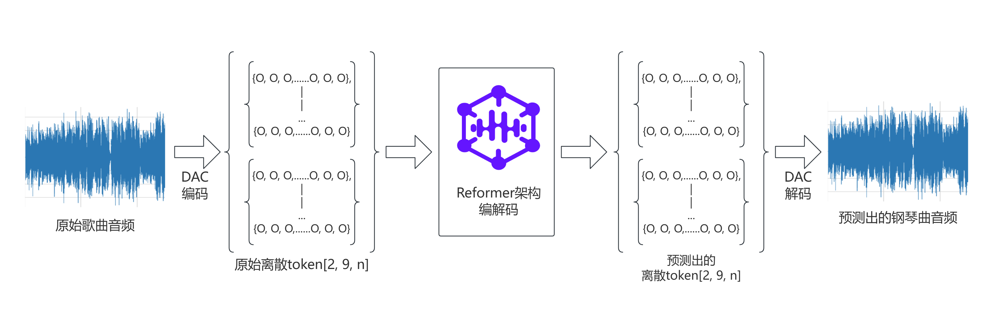

# 基于超长序列生成模型的“歌曲-钢琴曲”改编方法

项目基于 DAC（神经音频编解码器）与 Reformer（高效长序列 Transformer）构建端到端的“歌曲 → 钢琴曲”自动改编系统。该项目摒弃 MIDI 中间表示，直接将音频编码为离散 token 序列、在超长序列上做 Seq2Seq 学习，最后解码为高保真钢琴音频。

**模型架构简介**
本项目的核心由两部分组成：编码器（DAC）负责将音频离散化为 token 序列；以及基于 Reformer 的 Seq2Seq 模型负责从歌曲的 token 序列生成钢琴音色的 token 序列。下图展示了模型的整体架构与处理流程，便于理解数据在系统中的流动与各模块职责：

模型整体架构图：


整体流程图：


**主要贡献**
- **端到端范式**：直接从原始歌曲音频生成钢琴改编音频，避免音频→MIDI 的信息丢失。
- **超长序列建模**：采用 Reformer（LSH + 可逆残差 + 分块 FFN）支持最大 32768 长度的序列端到端建模。
- **工程优化**：结合梯度检查点、BF16 混合精度、长度分桶与动态填充，实现单卡 32GB 上的可训练性与高效推理。
- **专用配对数据集**：构建了 364 组高质量 {原始歌曲，钢琴改编} 配对样本并完成 DAC 离散化处理。

**仓库结构**
- [data2song.py](data2song.py)：将推理出的离散 token（JSONL/DAC）解码回 WAV 音频的工具。
- [Inference.py](Inference.py)：Reformer 模型的推理脚本（生成离散 token 序列）。
- [model_train.py](model_train.py)：模型训练核心代码，包含数据预处理、训练/验证循环与优化器配置。
- [song2data.py](song2data.py)：将歌曲音频通过 DAC 编码为离散 token（并拆分为 18 份 JSONL）的工具。


**运行环境 & 依赖（建议）**
- Python 3.10+
- PyTorch（与 CUDA 版本匹配）
- numpy, audiotools, pydub, tqdm，h5py


**快速开始（示例命令）**

1) 将歌曲编码为 token（生成 18 个 JSONL）：

```bash
python song2data.py --song_path "/path/to/song.mp3" --data_path "/path/to/output_jsonl_dir"
```

2) 从 JSONL 生成 DAC 并解码为 WAV（端到端一键流程）：

```bash
python data2song.py --jsonl_path "/path/to/jsonl_dir" --dac_path "/path/to/out_dac_dir" --song_path "/path/to/out_wav_dir"
```

3) 模型推理（示例）——参见 `Inference.py` 内完整参数说明：

```bash
python Inference.py --input_file "/path/to/input.jsonl" --checkpoint "/path/to/checkpoint.pt" --output_file "/path/to/output.jsonl" --device cuda
```

4) 训练（示例）——参见 `model_train.py` 内完整参数说明：

```bash
python model_train.py --enable_finetune false --finetune_model_path ""
```

**各脚本说明（简要）**
- `song2data.py`：
 	- 功能：读取单首歌曲，做响度归一化、调用预训练 DAC 将音频压缩并输出初始 JSONL，再将 codes 拆分为 18 份 JSONL（每份格式为数组）。
 	- 输出：18 个 JSONL，用于后续模型输入或分片处理。

- `data2song.py`：
 	- 功能：接受 JSONL 文件夹，构建统一的 DAC 数据结构并保存为 .dac 文件；通过自定义 decode 流（分块解码、响度校准）将 .dac 解码为可播放 WAV。
 	- 场景：将推理结果（离散 token）转回音频以便听感评估。

- `Inference.py`：
 	- 功能：实现 Reformer Seq2Seq 的推理逻辑（包含数据加载、批次动态填充、Greedy/采样生成策略等）。
 	- 说明：脚本内部参数较多，支持单/多 GPU、混合精度、top-k/temperature 等采样策略，请阅读文件顶部 `parse_args()` 获取完整说明。

- `model_train.py`：
 	- 功能：训练主逻辑（数据集构建、HDF5 切分、长度分桶、训练循环、梯度检查点、混合精度、保存 Checkpoint 等）。
 	- 说明：适配实验性的大模型训练流程，建议在有充足算力（32GB+ GPU）环境下运行，并根据实际显存与数据规模调整 `d_model`、`batch_size`、`max_len` 等超参数。

**数据格式说明**
- JSONL 中样例：每行为一个 JSON 对象或数组，包含 `codes`（离散 token 列表）、`chunk_length`、`original_length`、`input_db`、`channels`、`sample_rate`、`padding`、`dac_version` 等字段（参见 `song2data.py` 生成的格式）。
- DAC：本仓库脚本会把离散 token 包装为 `.dac`（NumPy 存储）以便后续解码。


---

